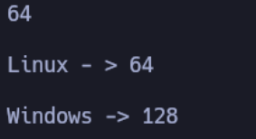

# MachineOs

Programm that helps you with the type of machine you are trying to encounter.

## Usage

Ip that we want to attack after we called the programm.

### Output

First lines is the machine ttl an you only need to compare it with the numeber that linux and windows have.

#### Requirments

We only need the "ping" function that almost every linux has it.

